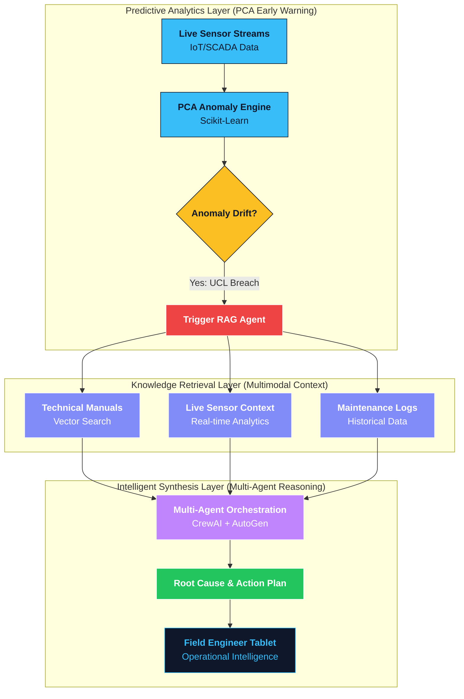
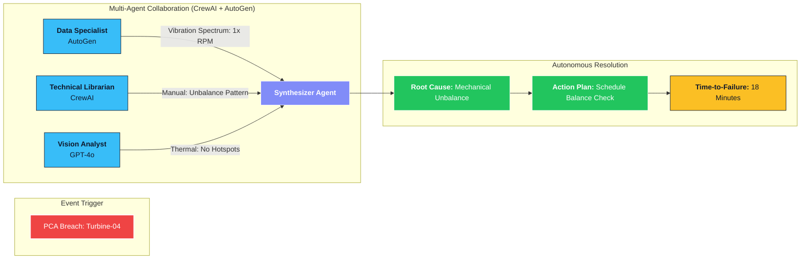

# Plant GPT | Industrial AI Assistant for Field Engineers

Plant GPT is a specialized **Multimodal RAG (Retrieval-Augmented Generation)** system designed for predictive maintenance and real-time troubleshooting in high-stakes industrial environments. 

The system acts as a technical intelligence bridge, triggered by an **Early Warning System (EWS)** that detects anomalies using **Principal Component Analysis (PCA)** 15–20 minutes before a potential failure occurs.

---

## Technical Architecture Overview

The platform integrates traditional machine learning with state-of-the-art Generative AI to provide field engineers with actionable insights from complex, multimodal data sources.

### 1. Early Warning & Triggering (PCA-based)
- **Anomaly Detection:** Continuously monitors real-time sensor streams (Temperature, Pressure, Vibration, Flow Rates).
- **PCA Model:** Uses Principal Component Analysis to identify multidimensional drifts from normal operating baselines.
- **Agent Trigger:** Once an anomaly is detected, the system triggers the RAG agent and provides the detected drift context as a "situational snapshot."

### 2. Multimodal RAG Engine
- **Technical Documentation:** High-precision retrieval from PDF manuals, maintenance logs, and safety protocols.
- **Sensor Data Integration:** Live numerical data from SCADA/IoT systems.
- **Visual Intelligence:** Processing of technical schematics, graph data, and real-time diagnostic charts.
- **Plain English Synthesis:** Translates complex multimodal inputs into simplified, conversational troubleshooting steps for field operations.

---

## System Workflow Visualization

---

## Visualization & Demo Insights

To demonstrate the system's effectiveness, the following visualizations are typically generated during the anomaly-to-resolution cycle:

### 1. PCA Anomaly Detection (Clustering & Reconstruction Error)
- **High-Dimensional Clustering:** Visualizes sensor data reduced to 2D/3D space. Normal operating states form dense, stable clusters, while anomalous drifts are identified as statistical outliers.
- **Isolation Forest Comparison:** While Isolation Forest was evaluated for its efficiency in high-dimensional outlier detection, **Principal Component Analysis (PCA)** was selected for production due to its superior reconstruction error sensitivity, providing a more reliable 15-20 minute lead time for industrial failures.
- **Reconstruction Error Trendline:** A time-series visualization tracking the variance from the learned baseline. A breach of the statistically defined "Upper Control Limit" (UCL) serves as the autonomous trigger for the RAG agent.

  

<i>Figure 1: Multidimensional clustering showing normal operating baseline vs. anomalous drift.</i>

  

<i>Figure 2: Real-time sensor trendlines showing the 20-minute lead time provided by the PCA engine.</i>

### 2. Multi-Agent Multimodal RAG Engine
Once the PCA Early Warning System triggers the alert, a sophisticated **Multi-Agent Orchestration** layer (powered by **CrewAI** and **AutoGen**) takes over to perform a deep-dive diagnostic across multimodal data streams:

- **Orchestration Framework:** Utilizes a decentralized multi-agent architecture where specialized agents collaborate to solve the diagnostic puzzle:
    - **Data Specialist Agent (AutoGen):** Interfaces with live SCADA/IoT streams to pull high-resolution numerical data and sensor trendlines.
    - **Technical Librarian Agent (CrewAI):** Performs semantic search across thousands of pages of PDF manuals and maintenance logs using **ChromaDB** and high-dimensional embeddings.
    - **Vision Analyst Agent:** Processes complex engineering schematics and real-time diagnostic charts to verify mechanical alignment issues.
    - **Synthesizer Agent:** Aggregates findings from all agents into a "Plain English" troubleshooting report for field engineers.
- **Multimodal Context Integration:** Simultaneously processes unstructured text, structured numerical data, and visual schematics to ensure a 360-degree understanding of the industrial event.
- **Self-Correction Loop:** Agents use a recursive feedback loop to cross-validate findings (e.g., if the Vision Agent detects a misalignment, the Data Agent verifies if the vibration frequency matches that specific mechanical failure).

#### Multi-Agent Diagnostic Trace (Agentic Workflow)

In the event of a PCA-triggered anomaly, the multi-agent system orchestrates a collaborative diagnostic sequence as visualized below:

---

## Business & Industrial Impact

- **90% Reduction in Search Time:** Engineers no longer need to manually navigate thousands of pages of technical documentation during an emergency.
- **Uptime Optimization:** Early warning allows for controlled shutdowns or rapid component replacement before catastrophic failure.
- **Knowledge Transfer:** Captures and digitizes institutional knowledge for future troubleshooting and training.

---

## Tech Stack (Conceptual)

- **AI/ML:** PCA (Scikit-Learn), LangChain (RAG Orchestration).
- **LLMs:** Llama 3 (Groq), GPT-4o-mini (Vision Integration).
- **Data:** DuckDB (Sensor Analytics), ChromaDB (Vector Search).
- **Parsing:** Layout-aware parsing of engineering PDFs and charts.

---

*This project represents professional work delivered for a previous organization, demonstrating expertise in combining Predictive Analytics with Generative AI for industrial reliability.*
